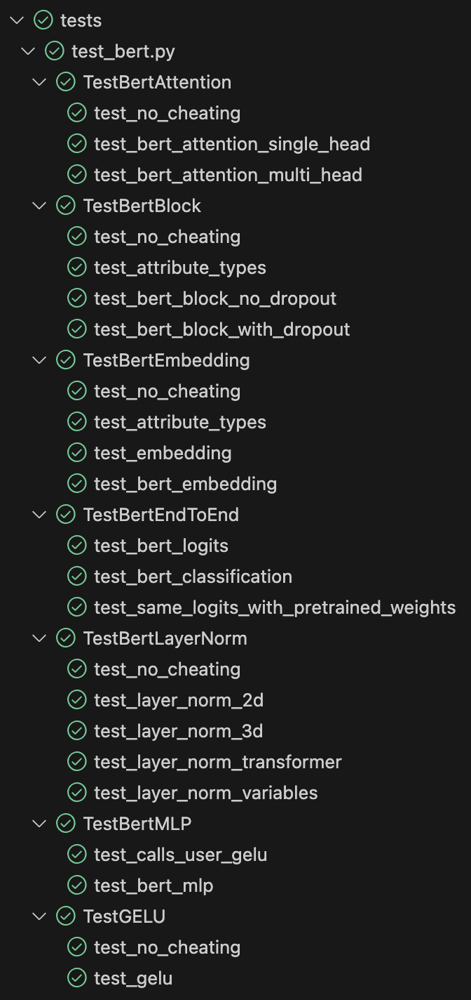

# MLAB BERT From Scratch 

Test passed 23/23.

With the help of MLAB Transformers repo, I reimplemented BERT from scratch. The MLAB Transformers repo is documented and unit-tested repo to help students to build transformer neural network models from scratch.

### Bert - All tests passed.

	

### Transformer architecture

	

